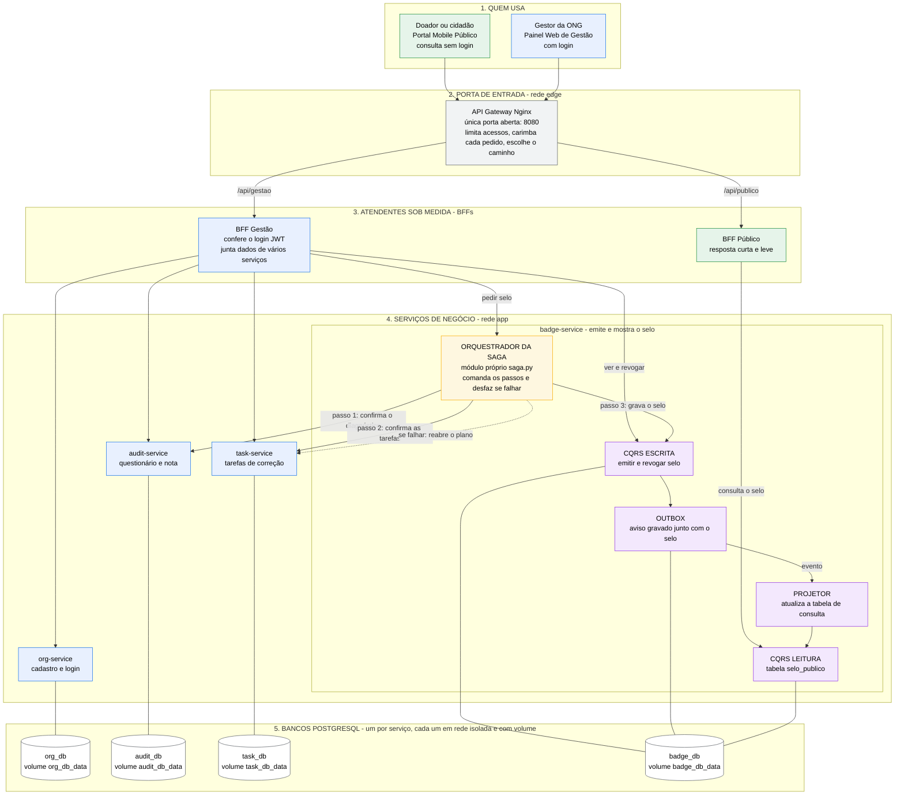

# Projeto_Tainara_Souza

```mermaid
flowchart TB
    subgraph CL["1. QUEM USA"]
        C1["Doador ou cidadão<br/>Portal Mobile Público<br/>consulta sem login"]
        C2["Gestor da ONG<br/>Painel Web de Gestão<br/>com login"]
    end

    subgraph BORDA["2. PORTA DE ENTRADA - rede edge"]
        GW["API Gateway Nginx<br/>única porta aberta: 8080<br/>limita acessos, carimba cada pedido, escolhe o caminho"]
    end

    subgraph BFFS["3. ATENDENTES SOB MEDIDA - BFFs"]
        BP["BFF Público<br/>resposta curta e leve"]
        BG["BFF Gestão<br/>confere o login JWT<br/>junta dados de vários serviços"]
    end

    subgraph SERV["4. SERVIÇOS DE NEGÓCIO - rede app"]
        ORG["org-service<br/>cadastro e login"]
        AUD["audit-service<br/>questionário e nota"]
        TSK["task-service<br/>tarefas de correção"]
        subgraph BADGE["badge-service - emite e mostra o selo"]
            SAGA["ORQUESTRADOR DA SAGA<br/>módulo próprio saga.py<br/>comanda os passos e desfaz se falhar"]
            W["CQRS ESCRITA<br/>emitir e revogar selo"]
            OUT["OUTBOX<br/>aviso gravado junto com o selo"]
            PROJ["PROJETOR<br/>atualiza a tabela de consulta"]
            R["CQRS LEITURA<br/>tabela selo_publico"]
        end
    end

    subgraph DADOS["5. BANCOS POSTGRESQL - um por serviço, cada um em rede isolada e com volume"]
        DORG[("org_db<br/>volume org_db_data")]
        DAUD[("audit_db<br/>volume audit_db_data")]
        DTSK[("task_db<br/>volume task_db_data")]
        DBAD[("badge_db<br/>volume badge_db_data")]
    end

    C1 --> GW
    C2 --> GW
    GW -->|"/api/publico"| BP
    GW -->|"/api/gestao"| BG

    BP -->|"consulta o selo"| R
    BG --> ORG
    BG --> AUD
    BG --> TSK
    BG -->|"pedir selo"| SAGA
    BG -->|"ver e revogar"| W

    SAGA -->|"passo 1: confirma o diagnóstico"| AUD
    SAGA -->|"passo 2: confirma as tarefas"| TSK
    SAGA -->|"passo 3: grava o selo"| W
    SAGA -.->|"se falhar: reabre o plano"| TSK

    W --> OUT
    OUT -->|"evento"| PROJ
    PROJ --> R

    ORG --- DORG
    AUD --- DAUD
    TSK --- DTSK
    W --- DBAD
    OUT --- DBAD
    R --- DBAD

    classDef publico fill:#e6f4ea,stroke:#1e8e3e,color:#000
    classDef gestao fill:#e8f0fe,stroke:#1a73e8,color:#000
    classDef saga fill:#fef7e0,stroke:#f9ab00,color:#000
    classDef cqrs fill:#f3e8fd,stroke:#9334e6,color:#000
    classDef borda fill:#f1f3f4,stroke:#5f6368,color:#000
    classDef banco fill:#fff,stroke:#5f6368,color:#000
    class C1,BP publico
    class C2,BG,ORG,AUD,TSK gestao
    class SAGA saga
    class W,OUT,PROJ,R cqrs
    class GW borda
    class DORG,DAUD,DTSK,DBAD banco
```
